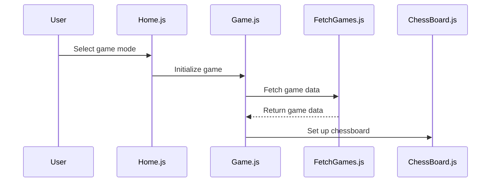
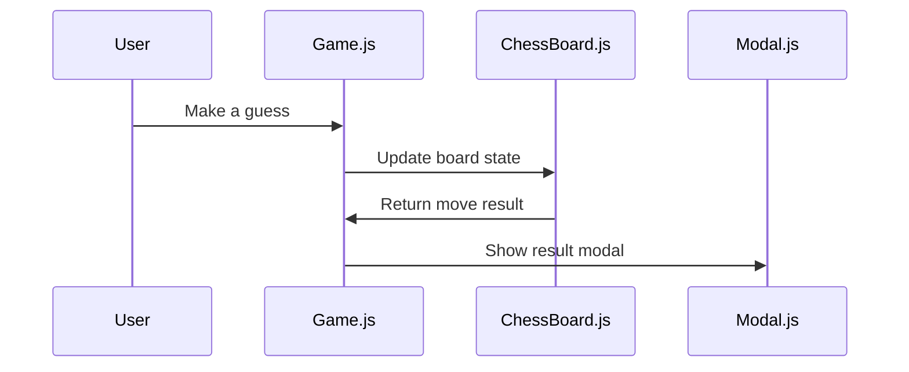
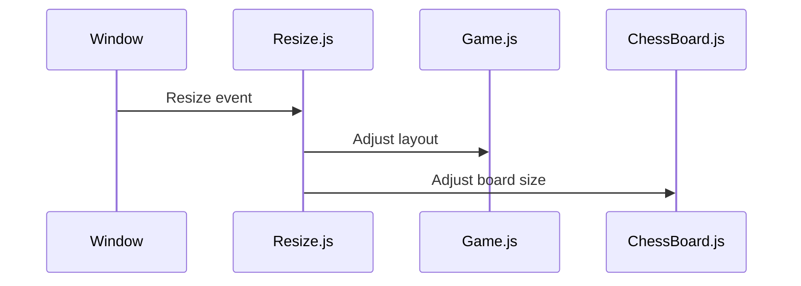

# Wiki Documentation for https://github.com/hieuimba/Guess-The-ELO

Generated on: 2025-06-16 20:44:30

## Table of Contents

- [Full Codebase Overview](#all-files-8076c4e1-d375-42a5-a00e-70fd08e2c874)

## Full Codebase Overview

# Codebase Wiki for Guess-The-ELO

## Table of Contents
- Overview
- File Descriptions
- Component Interactions
- Mermaid Diagrams

## Overview
Guess-The-ELO is a web-based quiz game where players guess the Elo rating of chess games. It features different game modes and uses chess data sourced from Lichess.

## File Descriptions

### Configuration and Metadata
- **.github/workflows/deploy-to-itch.yml**: GitHub Actions workflow for deploying the game to itch.io.
- **.gitignore**: Specifies files and directories to be ignored by Git.
- **.nojekyll**: Prevents GitHub Pages from using Jekyll.
- **CNAME**: Custom domain configuration for GitHub Pages.
- **sitemap.xml**: Sitemap for SEO and web crawling.

### Documentation
- **README.md**: Contains the project description, features, and instructions for playing the game.

### Styles and Assets
- **css/styles.css**: Stylesheet for the game's user interface.
- **favicon.ico**: Favicon for the game.
- **images/**: Contains various images used in the game, such as icons and background images.
- **sounds/**: Contains sound effects and background music for the game.

### HTML
- **index.html**: The main HTML file for the game, setting up the basic structure and linking scripts and styles.

### JavaScript
- **js/data/fetchGames.js**: Handles fetching chess game data from external sources.
- **js/elements/chessBoard.js**: Manages the chessboard display and interactions.
- **js/elements/clock.js**: Implements a clock feature for the game.
- **js/elements/modal.js**: Handles modal dialogs for various game interactions.
- **js/game.js**: Core game logic, including game initialization and scoring.
- **js/home.js**: Manages the home screen and game mode selection.
- **js/other/config.js**: Configuration settings for the game.
- **js/other/resize.js**: Adjusts the layout based on screen size changes.
- **js/other/utils.js**: Utility functions used throughout the game.

## Component Interactions

### Overview
The game consists of several interacting components, including the user interface, game logic, and external data fetching. The components communicate primarily through function calls and DOM manipulation.

### Mermaid Diagrams

#### Game Initialization

#### Game Interaction

#### Responsive Layout

This wiki provides a comprehensive overview of the Guess-The-ELO codebase, detailing the purpose and interaction of each component within the project.

---
