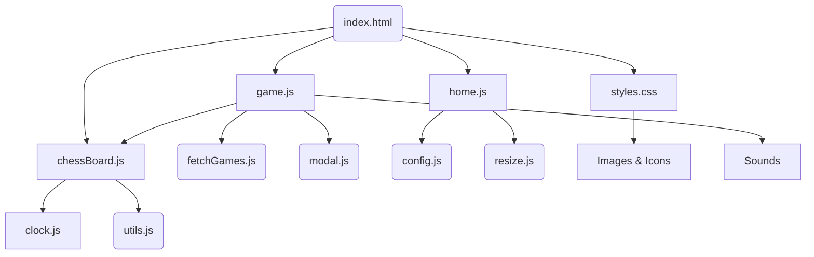

# Wiki Documentation for https://github.com/hieuimba/Guess-The-ELO

Generated on: 2025-06-15 19:51:53

## Table of Contents

- [Full Codebase Overview](#all-files-8a77fd6f-c707-48a9-9ba5-a5a646ba2372)

## Full Codebase Overview

### Wiki for Guess-The-ELO Codebase

---

#### Overview

Guess-The-ELO is a web-based game where players guess the Elo rating of chess matches. The game utilizes various HTML, CSS, and JavaScript components to deliver an interactive and engaging user experience. The game sources chess matches from Lichess and provides two modes: Classic and Endless.

---

#### File Structure

- **.github/workflows/deploy-to-itch.yml**: Configuration for deploying the project to itch.io.
- **.gitignore**: Specifies files and directories that should be ignored by Git.
- **.nojekyll**: Prevents Jekyll processing on GitHub Pages.
- **CNAME**: Custom domain configuration for GitHub Pages.
- **README.md**: Project description, features, and how-to-play instructions.
- **css/styles.css**: Stylesheet for the game's UI, defining layout and design elements.
- **favicon.ico**: Icon displayed in the browser tab.
- **images/**: Contains images for icons, background, and chess pieces.
- **index.html**: Main HTML file, structure of the web page.
- **js/data/fetchGames.js**: Handles fetching chess games data from Lichess.
- **js/elements/chessBoard.js**: Manages chessboard rendering and interactions.
- **js/elements/clock.js**: Manages countdown timer functionality.
- **js/elements/modal.js**: Handles modal window interactions.
- **js/game.js**: Core game logic, event handling, and UI updates.
- **js/home.js**: Manages home screen interactions and game mode selection.
- **js/other/config.js**: Configuration for game settings and responses.
- **js/other/resize.js**: Handles responsive design and element resizing.
- **js/other/utils.js**: Utility functions for randomization and selection processing.
- **sitemap.xml**: Sitemap for search engine indexing.
- **sounds/**: Contains sound effects and background music for the game.

---

#### Component Interaction Diagram

- **index.html**: Serves as the entry point, linking to all stylesheets and scripts.
- **styles.css**: Provides the visual styling for the HTML elements.
- **game.js**: Contains the primary game logic, interacting with `fetchGames.js` to get data and `chessBoard.js` for board interactions.
- **home.js**: Handles user interactions on the home screen and game mode selections, utilizing `config.js` and `resize.js` for settings and layout adjustments.
- **chessBoard.js**: Manages chessboard display and piece movements, interacting with `clock.js` for timing and `utils.js` for utility functions.
- **Images & Icons**: Used for visual elements on the webpage.
- **Sounds**: Used for auditory feedback during gameplay.

---

This wiki provides a high-level understanding of the Guess-The-ELO codebase, detailing file roles and interactions to aid developers in navigating and contributing to the project.

---
